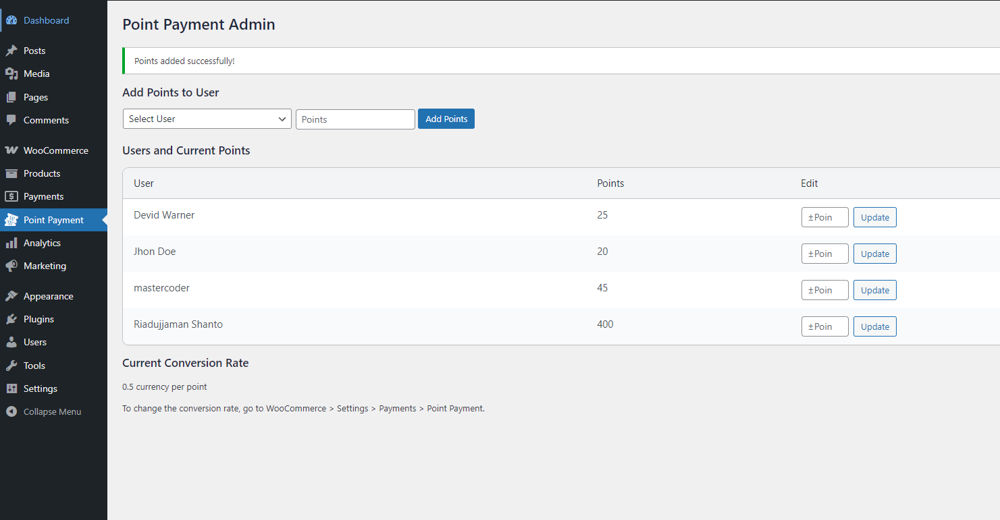

# Point Payment for WooCommerce

A simple, modern WooCommerce extension that allows customers to pay for orders using points. Admins can manage user points, view history, and set conversion rates.



## Features
- Customers can pay for orders using points
- Admin can add or reduce user points
- User point history and balance shown in My Account
- Custom WooCommerce My Account menu item ("My Points")
- Conversion rate configurable in WooCommerce settings
- Modern, elegant admin UI
- Secure backend logic for point management

## Installation
1. Upload the plugin folder to `wp-content/plugins/point-payment`
2. Activate the plugin from the WordPress admin dashboard
3. Ensure WooCommerce is installed and activated

## Usage
### For Customers
- Earn points as configured by the store owner
- Use points to pay for orders at checkout
- View current points and history in My Account > My Points

### For Admins
- Go to **Point Payment** in the WordPress admin menu
- Add or reduce points for any user
- View all users and their current points
- Set the conversion rate in WooCommerce > Settings > Payments > Point Payment

## File Structure
```
point-payment/
├── point-payment.php
├── admin/
│   └── class-point-payment-admin.php
├── assets/
│   ├── css/
│   │   └── admin.css
│   ├── js/
│   └── media/
├── frontend/
│   └── class-point-payment-frontend.php
├── includes/
│   └── class-point-payment-gateway.php
```

## How It Works
- **Checkout**: If enabled and user has enough points, "Pay with Points" appears as a payment option.
- **My Account**: Users see "My Points" menu item, showing balance and transaction history.
- **Admin Panel**: Admins can add or subtract points for users, and view all balances.
- **Conversion Rate**: Set how much each point is worth in store currency.

## Security
- All point management actions require admin permissions and nonce verification.
- Points cannot be reduced below zero.

## Customization
- CSS for admin and frontend can be customized in `assets/css/`
- Menu item position and labels can be changed in `frontend/class-point-payment-frontend.php`

## Support
For issues or feature requests, contact the author:
- **Author**: Riadujjaman Shanto
- **Website**: https://shanto.net

## License
GPL2 - See `license.txt` for details.
